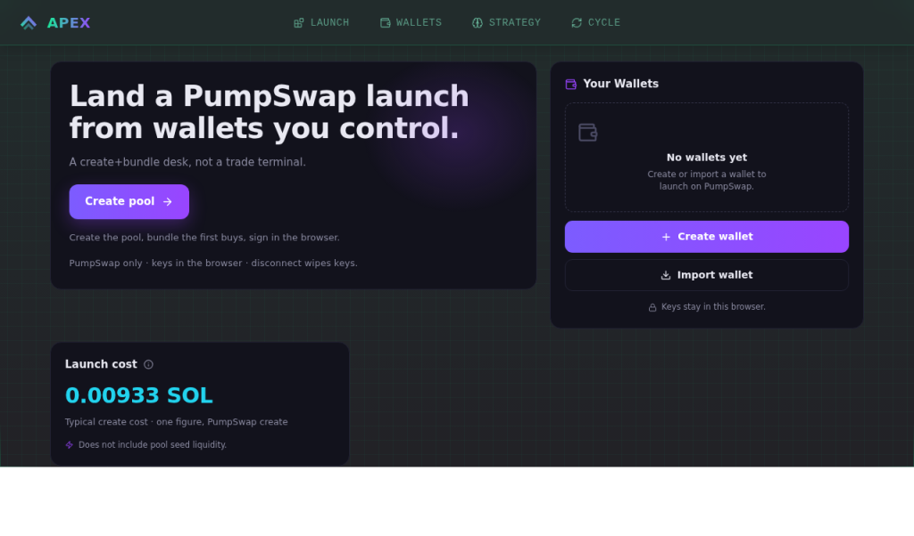
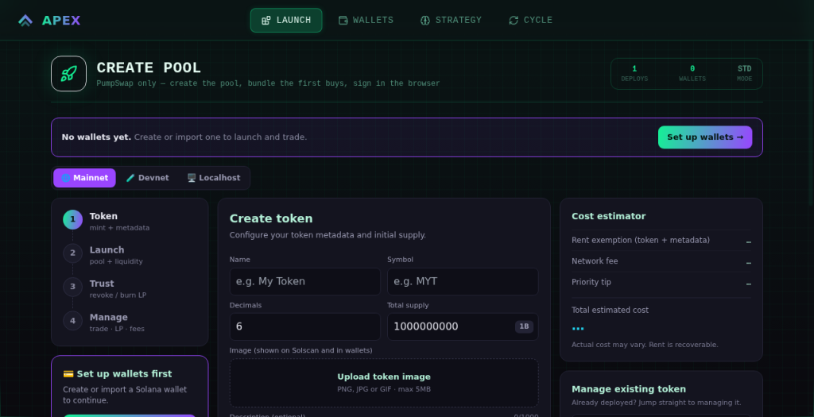
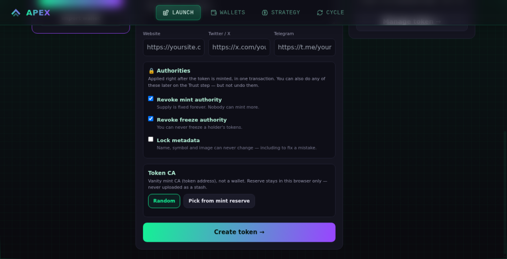
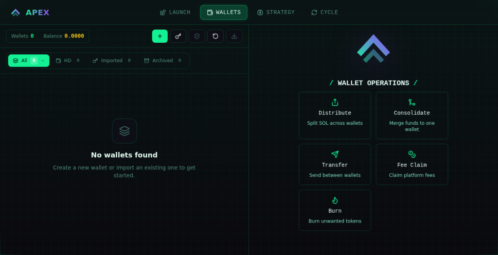
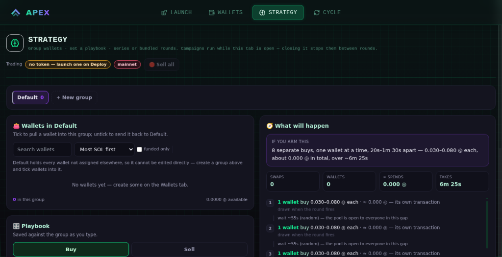
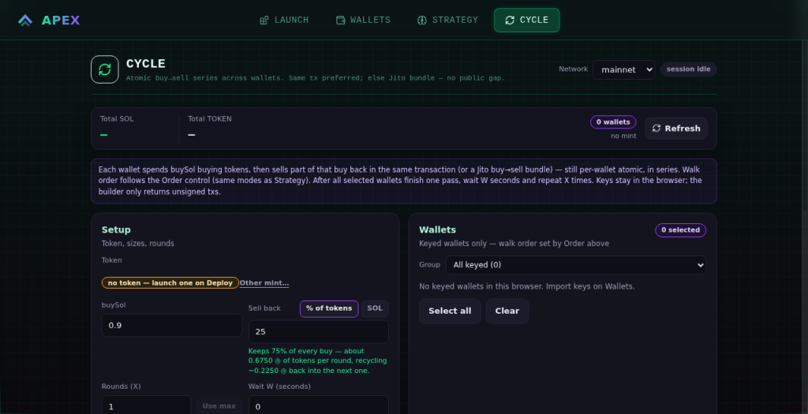
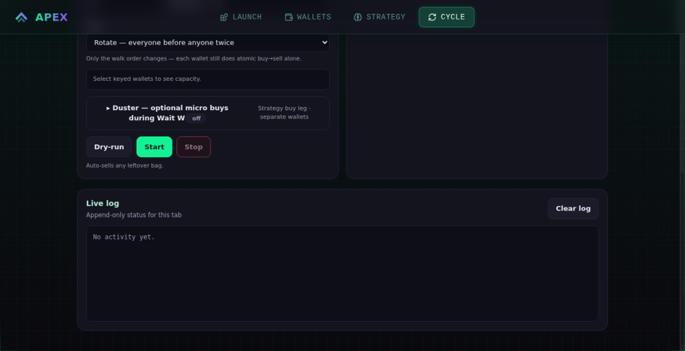

# APEX — Solana Pump.fun / PumpSwap Launch & Trade Terminal

### Token launcher · multi-wallet bundler · liquidity tooling · trade terminal

**Pump.fun launches → PumpSwap pools · seed liquidity · multi-wallet atomic bundles**  
**Use the live product on the web — private project, not an open-source download.**

**[Open apexlauncher.fun →](https://apexlauncher.fun)**

APEX is a **private** Solana launch & trade product. You use it on [apexlauncher.fun](https://apexlauncher.fun) for a **0.8% fee**. This GitHub page is for discovery and positioning only — **we do not distribute the repo/source** as a download.

---

## What APEX is

**APEX** is a Solana launch and trade terminal for operators who need:

- a **Pump.fun / PumpSwap token launcher**
- **multi-wallet bundling** (atomic buys across wallets)
- **liquidity seeding** into PumpSwap pools
- an ongoing **trading terminal** after launch

Search terms this page is for:

`solana bundler` · `pump.fun bundler` · `pumpswap launcher` · `pumpfun token launcher` · `jito bundle solana` · `multi wallet pump.fun` · `meme coin launcher solana` · `solana trading terminal`

> **How to use it:** go to [apexlauncher.fun](https://apexlauncher.fun) and run launches/trades there.  
> **Pricing:** **0.8%** fee.  
> **Access:** use APEX on [apexlauncher.fun](https://apexlauncher.fun). It is not an open-source pack or public app repo dump.

---

## Why teams use APEX

Most Solana launch tooling is either:

- **Expensive hosted bundler SaaS** — high fixed cost, someone else’s stack
- **Random GitHub scripts** — stale Pump.fun SDKs, broken PumpSwap paths, no single control plane

**APEX** is the install-and-create-tokens class of toolkit (launcher + bundler + trade), delivered as a **private product you use on the web** for **0.8%**.

| Capability | APEX |
| --- | --- |
| Solana token launcher (Pump.fun path) | ✅ |
| Create / work with **PumpSwap** pools | ✅ |
| **Seed liquidity** | ✅ |
| **Multi-wallet atomic bundles** | ✅ |
| Post-launch **trade terminal** | ✅ |
| Use on the web | ✅ **0.8% fee** |
| Public source / repo download | ❌ private |

---

## Product look (UI from [apexlauncher.fun](https://apexlauncher.fun))

| Launch desk | Create Pool | Pool form | Wallets |
| --- | --- | --- | --- |
|  |  |  |  |

| Strategy | Atomic cycle | Cycle + live log |
| --- | --- | --- |
|  |  |  |

---

## Use cases

1. **Pump.fun → PumpSwap launch ops** — create/launch, pool path, seed liquidity without juggling five scripts.  
2. **Multi-wallet atomic bundles** — coordinated buys across wallets in a tight window.  
3. **Post-launch trade control** — keep operating from one terminal after launch day.  
4. **Skip huge SaaS bills** — pay **0.8%** to use instead of large fixed hosted-bundler fees.

---

## How to start

1. Open **[apexlauncher.fun](https://apexlauncher.fun)**  
2. Use the launch & trade terminal in the product UI  
3. Launch → seed liquidity → bundle → trade  

**Fee: 0.8%.** No source download. Private web product only.

---

## APEX vs typical Solana bundlers & launchers

| | Hosted bundler SaaS | Random GitHub pumpfun scripts | **APEX** |
| --- | --- | --- | --- |
| Price | Often large fixed / high SaaS | “Free” until it breaks | **0.8% to use** |
| Delivery | Their hosted stack | Public scripts | **Private product on the web** |
| Pump.fun → **PumpSwap** | Varies / stale | Often outdated | **Built for it** |
| Token launcher + trade UI | Partial | CLI-only chaos | **One terminal** |
| Multi-wallet bundles | Yes (hosted) | DIY / fragile | **Yes** |

---

## Keywords & topics

**Product:** APEX, apexlauncher, apexlauncher.fun  

**Discovery terms:** Solana · Pump.fun · pumpfun · PumpSwap · token launcher · Solana launcher · meme coin launcher · bundler · Solana bundler · Pump.fun bundler · PumpSwap bundler · Jito bundler · multi-wallet · atomic bundle · liquidity seeding · trading terminal

**Suggested GitHub topics:** `solana` `pumpfun` `pump-fun` `pumpswap` `token-launcher` `solana-launcher` `bundler` `jito-bundler` `multi-wallet` `memecoin` `trading-terminal` `apexlauncher`

---

## Trust notes

- Live product: **[apexlauncher.fun](https://apexlauncher.fun)**  
- Fee: **0.8%**  
- This repository is a **public discovery page** for a **private** product  
- We **do not** distribute source packs or open the private project as a public install repo

---

## FAQ

**Can I download the repo / get the source?**  
No. APEX is private. You use it on [apexlauncher.fun](https://apexlauncher.fun).

**What does it cost?**  
**0.8%** fee to use on the site.

**Access:**  
Use the website with **0.8%** fees only.

**Pump.fun and PumpSwap both?**  
Yes — launch workflows including PumpSwap pool / liquidity work and multi-wallet bundles.

**How do I start?**  
Open [apexlauncher.fun](https://apexlauncher.fun).

---

## Looking for a Solana Pump.fun / PumpSwap launcher?

### **APEX — launch · bundler · trade terminal · 0.8% on the web**

**[Open apexlauncher.fun →](https://apexlauncher.fun)**

APEX · Solana token launcher · Pump.fun · PumpSwap · bundler · trading terminal · private product
