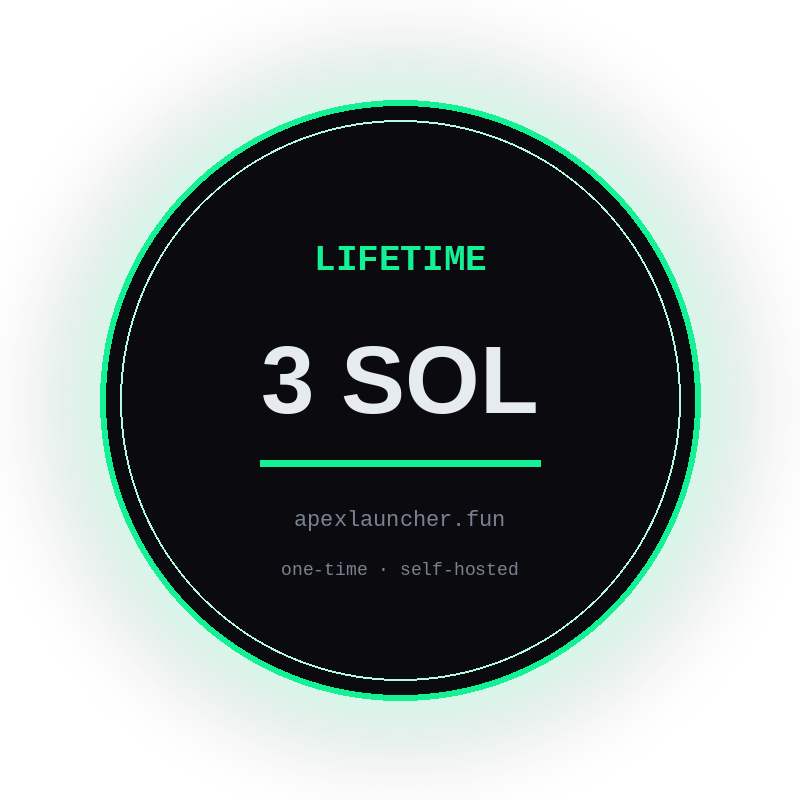

<!--
GitHub SEO targets (set on the repo when publishing):
Name:        apex-solana-pumpswap-launcher
Description: Self-hosted Solana Pump.fun / PumpSwap launch & trade terminal — token launcher, multi-wallet Jito bundler, liquidity seeding. Lifetime access 3 SOL.
Topics:      solana, pumpfun, pump-fun, pumpswap, pump-swap, token-launcher, solana-launcher,
             bundler, jito-bundler, multi-wallet, liquidity, memecoin, solana-bot,
             trading-terminal, self-hosted, apexlauncher
-->

<div align="center">


# APEX — Solana Pump.fun / PumpSwap Launch & Trade Terminal

### Self-hosted token launcher · multi-wallet bundler · liquidity tooling

**Pump.fun launches → PumpSwap pools · seed liquidity · Jito-style atomic wallet bundles**  
**Self-hosted Solana trading terminal — your RPC, your keys, your control.**



<br />

[](https://apexlauncher.fun)
[](#-get-lifetime-access--3-sol)
[](https://apexlauncher.fun)
[](#-get-lifetime-access--3-sol)

<br />

**[Open apexlauncher.fun →](https://apexlauncher.fun)** &nbsp;·&nbsp; **[Buy lifetime access (3 SOL) →](#-get-lifetime-access--3-sol)**

<p align="left">

**Premium access (one-time):** send <code>3 SOL</code> to <code>BrVEU6aZ4RDaG5viqbr9yWeSRufYjmy7TBvx5WoHTxXB</code>, then email the transaction signature to <a href="mailto:blinkenstephanie@gmail.com">blinkenstephanie@gmail.com</a> — you receive the <strong>open-source bot</strong> to run with no fees.<br /><br />
<strong>Limited release:</strong> only <strong>100 copies</strong> will be sold. First come, first served.

</p>

</div>

---

## Solana token launcher + bundler (what APEX is)

**APEX** is a **self-hosted Solana launch and trade terminal** for operators who need:

- a **Pump.fun / PumpSwap token launcher**
- **multi-wallet bundling** (atomic buys across wallets)
- **liquidity seeding** into PumpSwap pools
- an ongoing **Solana trading terminal** after launch

If you have been searching for any of these, you are in the right place:

`solana bundler` · `pump.fun bundler` · `pumpswap launcher` · `pumpfun token launcher` · `jito bundle solana` · `multi wallet pump.fun` · `self hosted solana terminal` · `meme coin launcher solana`

> This GitHub page is the **public sales + discovery page**.  
> After a **3 SOL** payment you receive the **open-source bot** by email and run it yourself **with no fees**.

---

## Why teams switch to APEX

Most Solana launch tooling is either:

- **Hosted bundler SaaS** — someone else’s stack, someone else’s risk surface (often **10–15 SOL+**)
- **Random GitHub scripts** — stale Pump.fun SDKs, broken PumpSwap paths, no single control plane

**APEX is the third path:** a self-hosted **Pump.fun → PumpSwap** launch terminal with bundling and trade control in one place.

| Capability | APEX |
| --- | --- |
| Solana token launcher (Pump.fun path) | ✅ |
| Create / work with **PumpSwap** pools | ✅ |
| **Seed liquidity** | ✅ |
| **Multi-wallet atomic bundles** | ✅ |
| Post-launch **trade terminal** | ✅ |
| **Self-hosted** (your infra, your keys) | ✅ |
| One-time **lifetime license** | ✅ **3 SOL** |

---

## Product look (real UI from [apexlauncher.fun](https://apexlauncher.fun))

| Launch desk | Create Pool | Pool form | Wallets |
| --- | --- | --- | --- |
|  |  |  |  |

| Strategy | Atomic cycle | Cycle + live log |
| --- | --- | --- |
|  |  |  |

> Screenshots are the live product UI (empty-state / 0 wallets on the public demo). After purchase you run the same terminal self-hosted with your wallets.

---

## Use cases (who buys APEX)


### 1) Pump.fun → PumpSwap launch ops
You’re launching on Solana and need a clean path from token launch into **PumpSwap** pools — create the pool, seed liquidity, and keep control without juggling five scripts.

**You get:** launcher + pool/liquidity workflow in one self-hosted terminal.

### 2) Multi-wallet atomic bundles
You need coordinated buys across wallets in a tight window (Jito-style atomic bundles) instead of clicking one wallet at a time and praying about ordering.

**You get:** multi-wallet bundle workflows from the same control surface.

### 3) Ongoing trade control after launch
Launch day isn’t the end — you want a **trading terminal** to manage positions, wallets, and follow-up actions on your own RPC.

**You get:** post-launch trade/control without moving to a random hosted dashboard.

### 4) “Don’t be the SaaS middleman”
You’re done paying **10–15 SOL** for hosted bundlers or trusting a black-box web app with your flow. You want **self-hosted** infra: your keys, your server, **3 SOL lifetime**.

**You get:** gated access + setup via Claude Code / Grok Bot / Cursor to build locally fast.

---

## What you get

**Lifetime premium access** — you receive a copy of the **open-source APEX bot** to run yourself:

- Full self-hosted **Pump.fun / PumpSwap launcher** (source delivered after payment)
- **Bundler** workflows for multi-wallet atomic execution
- Liquidity seeding + ongoing trade / control surface
- Run **without platform fees** once you have your copy
- Setup guidance optimized for **Claude Code / Grok Bot / Cursor** (build locally with an AI agent)

> **No monthly fee. No seat tax. No usage fees after you have the source.**  
> Pay **3 SOL** once → get the open-source bot by email → run it on your machine.  
> **Only 100 copies** will be sold (first come, first served).

---

## Who this is for

**Buy if you searched for:**
- Pump.fun bundler / PumpSwap bundler alternatives
- Solana meme coin launcher with real control
- Self-hosted Jito-style multi-wallet launch tooling
- A cheaper lifetime license than typical 10–15 SOL SaaS

**Skip if you want:**
- A hosted “we hold the keys” app
- Guaranteed fills / paid shill farms
- Free full source without paying (this repo is **sales + SEO/docs only**; source is emailed after 3 SOL)

---

## Get lifetime access — 3 SOL

<div align="center">

### How to buy (clear payment path)

**Pay on-chain → email the tx → receive open-source bot (no fees to run)**

> **Limited to 100 copies.** We will only sell **100** lifetime premium copies. **First come, first served** — once 100 confirmed payments are fulfilled, this offer closes.

</div>

### Step 1 — Send exactly `3 SOL` to this wallet only

```text
BrVEU6aZ4RDaG5viqbr9yWeSRufYjmy7TBvx5WoHTxXB
```

> Copy-paste carefully. If anyone DMs a **different** address, ignore them.

### Step 2 — Email your transaction signature

Send an email to:

```text
blinkenstephanie@gmail.com
```

Include:
- the **Solana transaction signature** (tx id) for the 3 SOL payment
- the email address where you want the open-source bot delivered (if different)

Subject line suggestion: `APEX 3 SOL purchase — <your tx signature>`

### Step 3 — Receive the open-source bot

After payment confirms on-chain, you are emailed a copy of the **APEX open-source bot** to run self-hosted **without fees**.

⏱️ Typical delivery: as soon as the payment confirms on-chain.

### Payment checklist

- [ ] Sent **exactly 3 SOL** to `BrVEU6aZ4RDaG5viqbr9yWeSRufYjmy7TBvx5WoHTxXB`
- [ ] Copied the **transaction signature**
- [ ] Emailed **blinkenstephanie@gmail.com** with the tx signature
- [ ] Ready to self-host (Solana RPC + wallets)

---

## How it works (after purchase)

```text
Pay 3 SOL → Email tx sig to blinkenstephanie@gmail.com → Receive open-source bot → AI agent builds it locally → Launch on Pump.fun / PumpSwap
```

1. Get your open-source bot copy by email (after payment confirms)  
2. Point APEX at your Solana RPC + wallets  
3. Launch → seed liquidity → bundle → trade from one terminal  

**Product:** [apexlauncher.fun](https://apexlauncher.fun)

---

## Easiest setup: let an AI coding agent build it locally

You do **not** need to be a senior Solana engineer to get APEX running.

The fastest path after purchase:

1. Open a local project folder on your machine  
2. Start **Claude Code**, **Grok Bot**, **Cursor**, or a similar AI coding agent  
3. Give it your APEX access materials + this prompt (adapt as needed):

```text
Build and run APEX locally from my access pack.
Follow the included setup notes, install dependencies,
configure RPC + wallets, and verify the launch & trade terminal starts.
```

4. Let the agent install, configure, and start the **self-hosted Solana launch & trade terminal** on your machine  
5. You keep the keys, RPC, and runtime on **your** infra

### Why this works well

- APEX is **self-hosted** — a local agent can wire RPC, env, and wallets without a hosted dashboard  
- Less copy-paste through broken README steps  
- Same flow works with Claude Code, Grok Bot, Cursor agent, Codex-style CLIs, etc.

> **Tip:** Prefer agents that can run commands and edit files in your project folder. Paste the open-source pack you receive after the 3 SOL payment — don’t share private keys in the prompt; let the agent use local env files you control.

---

## APEX vs typical Solana bundlers & launchers

| | Hosted bundler SaaS | Random GitHub pumpfun scripts | **APEX** |
| --- | --- | --- | --- |
| Price | Often **10–15 SOL+** | “Free” until it breaks | **3 SOL lifetime** |
| Keys / infra | Theirs | Yours (messy) | **Yours (structured)** |
| Pump.fun → **PumpSwap** | Varies / stale | Often outdated | **Built for it** |
| Token launcher + trade UI | Partial | CLI-only chaos | **One terminal** |
| Multi-wallet bundles | Yes (hosted) | DIY / fragile | **Yes (self-hosted)** |

---

## Keywords & topics (for discovery)

**Product terms:** APEX, apexlauncher, apexlauncher.fun  

**Search terms this page targets:**
Solana · Pump.fun · pumpfun · PumpSwap · pump swap · token launcher · Solana launcher · meme coin launcher · bundler · Solana bundler · Pump.fun bundler · PumpSwap bundler · Jito bundler · multi-wallet · atomic bundle · liquidity seeding · trading terminal · self-hosted · Solana bot tooling

**Suggested GitHub topics (apply on the repo):**  
`solana` `pumpfun` `pump-fun` `pumpswap` `token-launcher` `solana-launcher` `bundler` `jito-bundler` `multi-wallet` `memecoin` `trading-terminal` `self-hosted` `apexlauncher`

---

## Trust notes

- This repository is a **public sales + discovery page** — **not** the full application source.
- You pay on-chain to our receive wallet; the **open-source bot** is emailed after confirmed payment.
- Official receive address only:

```text
BrVEU6aZ4RDaG5viqbr9yWeSRufYjmy7TBvx5WoHTxXB
```

- If a DM asks you to pay a **different** wallet, **don’t** — only use the address above.

---

## FAQ

**Is this a free open-source Pump.fun bundler?**  
Not on this public sales repo. After **3 SOL**, you are emailed the **open-source bot** to run yourself with **no fees**. This repo is the clear buy page for people searching GitHub.

**Pump.fun and PumpSwap both?**  
Yes — the product path is built around Solana launch workflows including **PumpSwap** pool / liquidity work and multi-wallet bundles.

**Do you take custody of my keys?**  
No. Self-hosted. Your server, your wallets.

**Do I have to set it up by hand?**  
No. The easiest path is to use **Claude Code**, **Grok Bot**, **Cursor**, or a similar coding agent and ask it to build and run APEX locally from your access pack.

**Why only 100 copies?**  
Hard cap for this release: **100 premium copies**, first come, first served. After 100 confirmed payments, sales stop.

**Is 3 SOL really lifetime?**  
Yes — one payment for access to this product line’s updates. No subscription.

**What if I pay and don’t get a reply?**  
Re-email the tx signature to **blinkenstephanie@gmail.com**. On-chain payment is the source of truth.

---

<div align="center">

## Looking for a Solana Pump.fun / PumpSwap launcher?

### **APEX — self-hosted terminal · multi-wallet bundler · 3 SOL lifetime**

**[Pay 3 SOL & email tx →](#-get-lifetime-access--3-sol)** · **[Visit apexlauncher.fun](https://apexlauncher.fun)** · **blinkenstephanie@gmail.com**

<br />

<sub>APEX · Solana token launcher · Pump.fun · PumpSwap · bundler · trading terminal</sub>

</div>
